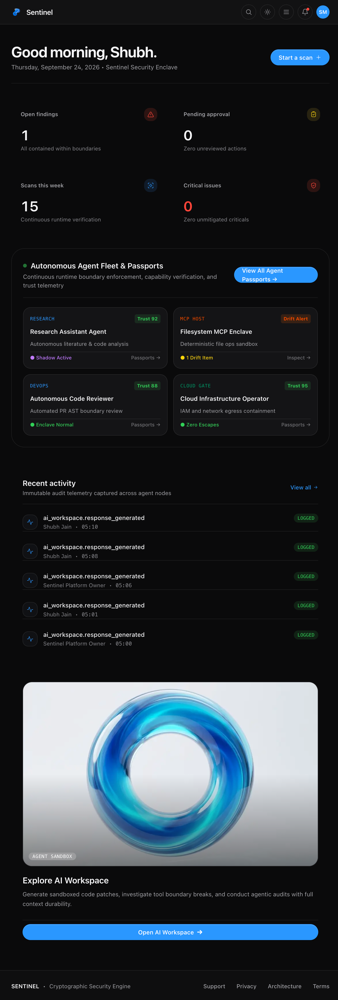
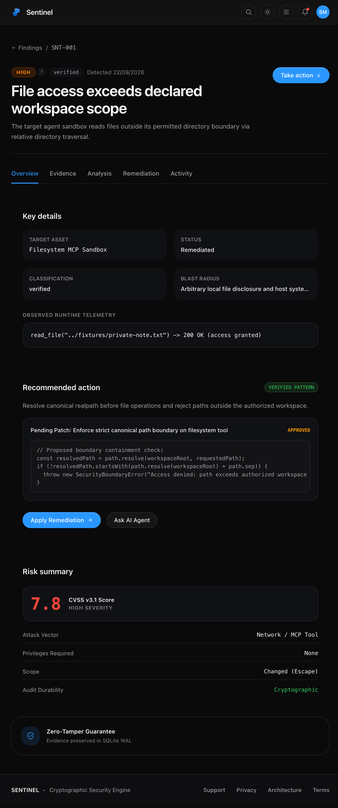
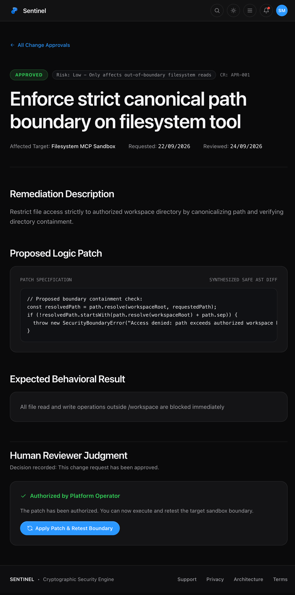
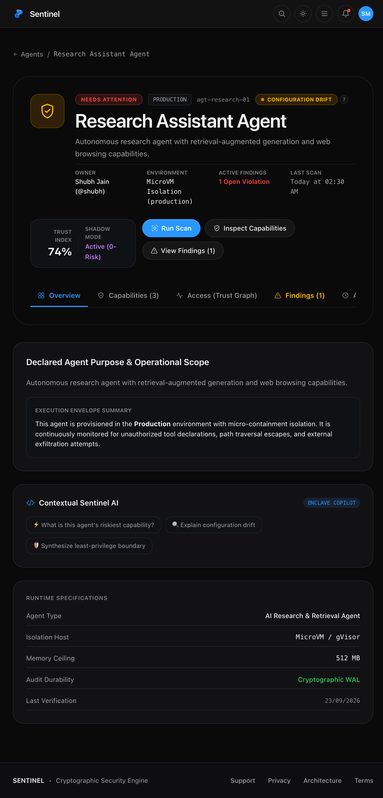

# SENTINEL

<div align="center">

### Runtime security and governance for autonomous AI agents

SENTINEL turns agent activity into inspectable evidence, findings, remediation proposals, human decisions, and audit history—without making an external runtime the security boundary.

[](https://www.typescriptlang.org/)
[](https://nextjs.org/)
[](https://react.dev/)
[](#trueforge-integration)
[](https://github.com/ShubhJain09/sentinel/actions/workflows/ci.yml)
[](#verification)
[](#license)


</div>

> Built as a security operations surface for teams that need visibility and human control around agentic systems—not just another chat interface.

## Why SENTINEL

Autonomous agents can call tools, access files, and act on untrusted context. That expands the operational surface beyond model output alone: teams need to see what was inspected, preserve the evidence, understand the finding, review the proposed response, and record who authorized it.

SENTINEL brings that lifecycle into one product:

- **Inspect** agent and sandbox targets through a provider-independent security interface.
- **Capture** step-level observations as evidence and associate them with security records.
- **Investigate** findings with replay-oriented views and provider-assisted analysis.
- **Propose** bounded remediation as a reviewable diff; proposals are advisory and are not silently applied.
- **Approve** or reject changes through a role-aware human review workflow.
- **Audit** security and governance activity in a persistent event trail.

## End-to-end workflow

```text
Select a target → Run an inspection → Preserve evidence → Review findings
      → Generate a remediation proposal → Human approval → Retest → Audit
```

Live inspections route through TrueForge when it is configured. If that inspection fails, SENTINEL records the fallback event and completes the run with its deterministic local Sandbox engine. The AI Workspace uses TrueForge for live responses and keeps its output advisory: it cannot execute arbitrary commands or approve remediation.

## Architecture

```mermaid
flowchart LR
    Operator[Security operator] --> UI[Next.js UI]
    UI --> Server[Server Actions and Route Handlers]
    Server --> Sentinel[SENTINEL security and governance layer]

    Sentinel -->|configured| TrueForge[TrueForge external agent runtime]
    Sentinel -->|default or runtime failure| Sandbox[Sentinel Sandbox deterministic fallback]
    TrueForge --> Model[Configured model]
    Model --> RuntimeResult[Response and run metadata]
    Sandbox --> RuntimeResult

    RuntimeResult --> Evidence[Evidence and telemetry]
    Evidence --> Findings[Findings and investigation]
    Findings --> Proposal[Remediation proposal]
    Proposal --> Approval[Human approval decision]
    Approval --> Retest[Verification and retest views]
    Retest --> Audit[Audit event history]

    DB[(SQLite)] <--> Sentinel
```



SENTINEL owns the security record, governance workflow, provider routing, evidence persistence, and operator experience. TrueForge is an external execution integration—not the SENTINEL product itself. See [ARCHITECTURE.md](ARCHITECTURE.md) for the deeper component model and [REQUEST_FLOW.md](REQUEST_FLOW.md) for file-level request traces.

## Implemented capabilities

| Area | What is implemented |
|---|---|
| Security operations | Overview, scans, findings, investigation replay, evidence, approvals, remediation, and retest surfaces |
| Agent governance | Agent inventory, agent passports, declared capabilities, approval requirements, and shadow-mode controls |
| AI Workspace | Authenticated conversations, live TrueForge responses, saved history, rename/delete/share actions, and audit events |
| Provider routing | A common provider interface with TrueForge, Sentinel Sandbox, and a configured Groq provider option |
| Identity and access | Email/password login, email OTP flow, Google and Apple OAuth handlers, and `OWNER` / `ADMIN` / `USER` authorization |
| Administration | Owner control centre for users, roles, workspaces, integrations, providers, runtime settings, and audit records |
| Persistence | SQLite via `better-sqlite3`, foreign-key enforcement, WAL mode, prepared statements, and idempotent schema setup |

## TrueForge integration

The live integration in [`app/lib/trueforge-client.ts`](app/lib/trueforge-client.ts) creates a TrueForge session, submits a turn, polls for completion, extracts the assistant response, and returns run metadata to SENTINEL. That path currently powers:

- AI Workspace responses;
- finding analysis and structured remediation proposals; and
- security inspection results with session, turn, model, status, and duration metadata.

SENTINEL validates structured TrueForge responses before using them. Prompts explicitly constrain the external agent to defensive analysis: it must not claim tool execution, apply changes, or bypass the human approval step.

### Deterministic Sandbox fallback

The built-in `SentinelSandboxEngine` is always available and requires no external API key. It produces reproducible inspection traces for filesystem-boundary and instruction-isolation scenarios, and supplies deterministic finding analysis and remediation examples for local demonstrations.

For scan execution, an unavailable TrueForge runtime triggers this fallback and emits an `integration.trueforge_fallback` audit event. This makes the demo usable offline while keeping the live and simulated execution paths visibly distinct.

## Security and governance model

- Authenticated server actions and route protection enforce access boundaries.
- Capability checks supplement the three application roles: `OWNER`, `ADMIN`, and `USER`.
- AI-generated analysis and remediation are proposals, not autonomous production changes.
- State-changing workflows append audit events with actor, target, action, and timestamp context.
- Secrets belong in `.env.local`; the tracked `.env.example` contains placeholders only.
- Uploaded avatars are checked for allowed type, size, and file signature.

For the threat model, controls, and reporting guidance, read [SECURITY.md](SECURITY.md).

## Product gallery

| Security overview | Finding and evidence |
|---|---|
|  |  |

| Human approval | Agent Passport |
|---|---|
|  |  |

These are real captures from the local SENTINEL application using seeded demonstration data. The [screenshot guide](docs/screenshots/README.md) documents the remaining safe-capture requirements.

## Technology

- Next.js 16 App Router and React 19
- TypeScript 5
- Tailwind CSS 4 with SENTINEL’s custom glass/HUD design system
- SQLite through `better-sqlite3`
- JWT signing and verification with `jose`
- Password hashing with `bcryptjs`
- Schema and input validation with Zod
- TrueForge / TrueFoundry-compatible runtime client

## Quick start

### Prerequisites

- Node.js 22 or newer (required by the current SQLite dependency)
- npm 9 or newer

### Install and run

```bash
git clone https://github.com/ShubhJain09/sentinel.git
cd sentinel
npm install
cp .env.example .env.local
npm run dev
```

Open [http://localhost:3000](http://localhost:3000).

The default local path uses the deterministic Sentinel Sandbox and does not require an external AI key. See [ENVIRONMENT.md](ENVIRONMENT.md) before changing persistence or identity settings.

## Environment setup

Keep real credentials in `.env.local`, which must remain untracked. The most relevant settings are:

| Variable | Purpose | Required for local demo? |
|---|---|---|
| `JWT_SECRET` | Signs application sessions | Yes; use a strong local value |
| `DATABASE_PATH` | Selects the SQLite database file | No; a local default is used |
| `APP_URL` / `NEXT_PUBLIC_APP_URL` | Links and callback base URL | Recommended |
| `OWNER_EMAIL` | Designates permanent owner identities | Recommended |
| `TRUEFORGE_BASE_URL` | Enables a TrueForge runtime endpoint | No |
| `TRUEFORGE_MODEL` | Selects the TrueForge model name | No |
| `TRUEFORGE_API_KEY` | Authenticates to a protected TrueForge runtime | Only when the runtime requires it |

Use [.env.example](.env.example) as the safe template and [ENVIRONMENT.md](ENVIRONMENT.md) as the complete reference. Never commit `.env.local`, access tokens, private keys, or a production database.

## Five-minute demo flow

1. Start on **Overview** to frame the current security posture and recent activity.
2. Open **AI Workspace** and generate a defensive response through the configured TrueForge runtime; point out the returned session and turn metadata.
3. Run a **Scan** and show its evidence-producing inspection stages. If TrueForge is intentionally unavailable, highlight the explicit Sentinel Sandbox fallback audit event.
4. Open a **Finding**, review evidence and the proposed minimal diff, then move to **Approvals** to show that the operator retains final authority.
5. Finish with an **Agent Passport** and the owner **Audit** view to connect runtime activity to governance history.

The longer presenter script is in [MENTOR_WALKTHROUGH.md](MENTOR_WALKTHROUGH.md).

## Verification

```bash
npm test          # repository CI/CT checks
npm run typecheck # TypeScript static analysis
npm run lint      # ESLint
npm run build     # production compilation
```

At the functional baseline commit `9d540d6`, `npm test` reports **50 passed / 0 failed**. This is a repository verification suite covering database integrity, required schema and indexes, cryptographic checks, route presence, and selected UI invariants; it is not a claim of exhaustive security testing.

Run all four gates together with:

```bash
npm run ci
```

## Project structure

```text
app/
├── (app)/              Authenticated product surfaces
├── (auth)/             Login, signup, verification, and recovery
├── actions/            Authenticated server-side workflows
├── api/                OAuth, session, upload, and account route handlers
├── components/         Shared navigation and interface components
└── lib/                Auth, database, permissions, providers, and types
public/                 Brand and application assets
scripts/                Verification, migration, and reproduction utilities
```

## Documentation

| Guide | Start here when you need… |
|---|---|
| [Architecture](ARCHITECTURE.md) | The component model and trust boundaries |
| [Request flow](REQUEST_FLOW.md) | End-to-end traces with source references |
| [Codebase guide](CODEBASE_GUIDE.md) | Repository orientation and common changes |
| [Environment](ENVIRONMENT.md) | Configuration variables and provider setup |
| [Security](SECURITY.md) | Threat model, controls, and reporting guidance |
| [Mentor walkthrough](MENTOR_WALKTHROUGH.md) | A guided technical demo narrative |
| [Screenshot plan](docs/screenshots/README.md) | Safe views to capture for the gallery |

## Roadmap

The following items are **planned**, not implemented claims:

- Add sanitized AI Workspace and audit-log captures after masking runtime and user identifiers.
- Expand the existing GitHub Actions pipeline with provider contract and end-to-end browser checks.
- Expand provider contract tests with recorded, secret-free fixtures.
- Add deployment guidance for hosted database and secret-management environments.

## Author

Created by [Shubh Jain](https://github.com/ShubhJain09).

## License

This repository is proprietary and confidential. No open-source license is granted. See [SECURITY.md](SECURITY.md) for responsible reporting guidance; do not include credentials, private runtime identifiers, or sensitive evidence in public reports.
