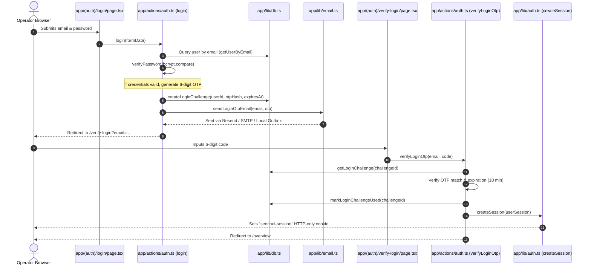

# Sentinel — Request Flow Traces & Execution Lifecycle

This document provides detailed step-by-step traces of the **10 core application flows** in Sentinel. For each flow, the lifecycle from the user's initial browser action to database persistence and UI update is documented with exact file references.

---

## Flow 1: Email & Password Login with OTP Challenge

- **Files Involved**:
  - Presentation: `app/(auth)/login/page.tsx`, `app/(auth)/verify-login/page.tsx`
  - Mutation: `app/actions/auth.ts` (`login`, `verifyLoginOtp`)
  - Verification: `app/lib/auth.ts` (`verifyPassword`, `createSession`)
  - Notification: `app/lib/email.ts` (`sendLoginOtpEmail`)
  - Persistence: `app/lib/db.ts` (`login_challenges`, `audit_events`)

---

## Flow 2: User Registration & Onboarding Flow

1. **User Submission**: Visitor fills in name, email, password on `app/(auth)/signup/page.tsx`.
2. **Server Action Invocation**: Calls `signup(formData)` in `app/actions/auth.ts`.
3. **Validation**: Checks password complexity (min 8 characters, uppercase, lowercase, numbers, special characters) and confirms email uniqueness against `users` table.
4. **Account Creation**: Hashes password using `bcrypt.hash(password, 10)`, assigns workspace ID, sets initial role to `'user'`, and persists record into `users` table.
5. **Session Issuance**: Calls `createSession(...)` in `app/lib/auth.ts` to issue the `sentinel-session` HTTP-only cookie.
6. **Onboarding Routing**: Redirects to `app/(auth)/onboarding/profile/page.tsx` where operator configures handle, bio, and initial workspace parameters.

---

## Flow 3: Password Reset Flow (Forgot Password -> Token -> Reset)

1. **Initiation**: User visits `app/(auth)/forgot-password/page.tsx` and submits email.
2. **Token Generation**: `forgotPassword(email)` in `app/actions/password-reset.ts` (re-exported via `app/actions/auth.ts`) checks user existence. Generates cryptographic token via `crypto.randomBytes(32).toString('hex')`.
3. **Database Record**: Stores token with 1-hour expiry in `password_reset_tokens` table.
4. **Email Dispatch**: `sendPasswordResetEmail(...)` in `app/lib/email.ts` formats transactional HTML with secure reset URL (`/reset-password?token=...`) and sends via active email provider (Resend, Postmark, SMTP, or local outbox).
5. **Password Reset Page**: User clicks link to `app/(auth)/reset-password/page.tsx`.
6. **Execution**: `resetPassword(token, newPassword)` in `app/actions/password-reset.ts` verifies token has not expired and has not been used (`usedAt IS NULL`), updates `passwordHash` in `users` table, marks token used, and logs `user.password_reset` to `audit_events`.

---

## Flow 4: Profile Password Change Flow

1. **Modal Trigger**: Authenticated operator opens Security tab in `app/(app)/profile/page.tsx` and clicks "Change Password".
2. **Submission**: Enters Current Password, New Password, and Confirm Password.
3. **Server Action**: Calls `changePassword(formData)` in `app/actions/profile.ts` (re-exported via `app/actions/auth.ts`).
4. **Identity Verification**:
   - Fetches active user via `getSession()`.
   - Compares supplied current password against `dbUser.passwordHash` using `bcrypt.compare`. If incorrect, throws `Current password is incorrect`.
5. **Policy Verification**: Confirms new password differs from current password and satisfies all 5 password policy checks.
6. **Update & Revocation**:
   - Updates `passwordHash` and `updatedAt` in `users`.
   - Automatically invalidates any existing unused password reset tokens.
   - Dispatches a security notification email confirming password was changed.
   - Appends audit event `user.password_change_from_profile`.

---

## Flow 5: Admin Centre Access & RBAC Route Protection Flow

1. **Browser Request**: User clicks link to `/owner` or any subroute (e.g. `/owner/users`).
2. **Edge Middleware (`middleware.ts`)**:
   - Extracts `sentinel-session` JWT from request cookies.
   - Decodes claims via `jwtVerify`.
   - If route is an owner-only surface (`/owner/secrets`, `/owner/diagnostics`, `/owner/security`) and role is NOT `owner`, redirects to `/owner?error=Owner+privileges+required`.
   - If role is `owner` or `admin`, passes request to Next.js handler.
   - If role is `user`, bounces request to `/api/auth/refresh?redirect=/owner`.
3. **Refresh Route Handler (`app/api/auth/refresh/route.ts`)**:
   - Node.js runtime queries live database: `getUserById(userId)`.
   - If the user was recently promoted to `admin` or `owner`, re-signs a fresh JWT cookie and redirects to `/owner`.
   - If still a standard user in the database, redirects to `/overview?error=Unauthorized+access`.
4. **Server Component Guard (`app/(app)/owner/layout.tsx`)**:
   - Re-verifies live session: `if (!session || (session.role !== 'owner' && session.role !== 'admin')) redirect('/overview');`.
   - Renders Admin Centre with appropriate role badges.

---

## Flow 6: Role Promotion & Demotion Flow (`OWNER` managing `ADMIN`/`USER`)

1. **UI Action**: Platform Owner visits `/owner/users` and changes a user's role in the dropdown to `Admin`.
2. **Server Action**: Calls `updateUserRole(userId, newRole)` in `app/actions/owner.ts`.
3. **Strict Owner Check**:
   - Calls `requireOwner(session)`. If actor is an Admin, the mutation is rejected (`Platform OWNER privileges required`).
4. **Target Invariant**:
   - Prevents modifying or demoting the platform owner account.
5. **Persistence & Audit**:
   - Updates `role` in `users` table.
   - Inserts audit event `user.role_updated` recording who made the change.
6. **Immediate Effect**:
   - The promoted user's next request to `/owner` will automatically detect the updated role via `getSession()`'s live database check, granting immediate access.

---

## Flow 7: Security Scan Execution Flow

1. **Trigger**: Operator clicks "Run Inspection" on `app/(app)/scans/new/page.tsx`.
2. **Server Action**: Invokes `runNewScan(formData)` in `app/actions/scans.ts`.
3. **Capability Check**: Validates `hasPermission(session.role, 'scan.create')`.
4. **Scan Record Initialization**:
   - Inserts record into `scans` table with status `'running'`.
   - Logs audit event `scan.started`.
5. **AI Provider Execution**:
   - Calls `getActiveProvider().runSecurityInspection(target, scope)` in `app/lib/ai-provider.ts`.
   - Simulates or executes boundary audits (e.g. `mcp::read_file("../fixtures/private-note.txt")`).
6. **Evidence Capture**:
   - Saves intermediate inspection steps into `evidence` table linked to core findings.
7. **Verdict & Completion**:
   - Updates scan status to `'completed'`, records verdict (`passed`, `needs_review`, `failed`), execution duration, and logs audit event `scan.completed`.
   - Revalidates paths `/scans` and `/overview`.

---

## Flow 8: AI Security Workspace Flow (Chat & Persistence)

1. **User Prompt**: Analyst submits a query in `app/(app)/ai-workspace/workspace-content.tsx`.
2. **Workspace Action**: Calls `saveAiConversationAction({ id, title, messages })` in `app/actions/ai-workspace.ts`.
3. **Ownership Verification**:
   - Verifies active session.
   - If updating an existing conversation (`conv.id`), queries `ai_conversations` table to confirm `userId === session.userId`.
4. **Payload Guard**:
   - Verifies message count is under 500 and title length is within 80 characters.
5. **Database Upsert**:
   - Inserts or updates conversation in `ai_conversations` with serialized JSON messages.
6. **Revalidation**: Revalidates `/ai-workspace` to keep sidebar history synchronized.

---

## Flow 9: Remediation Execution & Retest Flow

1. **Review**: Security reviewer inspects proposed boundary containment patch on `/approvals`.
2. **Approval**: Calls `decideApproval(approvalId, 'approved')` in `app/actions/approvals.ts`.
   - Requires `approval.review` permission.
   - Creates a pending remediation record in `remediations`.
3. **Execution & Retest**: Reviewer clicks "Apply & Retest Patch".
   - Calls `executeAndRetestRemediation(approvalId)` in `app/actions/approvals.ts`.
   - Requires `remediation.manage` permission.
   - Updates remediation status to `'verified'` with retest result: `Passed 6 of 6 checks`.
   - Updates finding status in `findings` table to `'remediated'`.
   - Logs audit events `remediation.executed` and `remediation.retested`.
   - Revalidates `/approvals`, `/findings`, and `/overview`.

---

## Flow 10: Profile Avatar Upload Flow

1. **File Selection**: User selects an image file on `/profile`.
2. **HTTP POST**: Browser sends `multipart/form-data` to `app/api/upload/avatar/route.ts`.
3. **Authentication**: Confirms active session via `getSession()`.
4. **Validation**:
   - File size under 5MB.
   - Allowed MIME types: `image/jpeg`, `image/png`, `image/webp`, `image/gif`.
   - **Magic Byte Validation**: Validates image binary headers (`0xFF, 0xD8` for JPEG, `0x89, 0x50, 0x4E, 0x47` for PNG, etc.).
5. **Path Containment & Old Avatar Deletion**:
   - Sanitizes old avatar path using `path.basename` and ensures deletion happens strictly inside `public/uploads/avatars/`.
6. **File Write**:
   - Generates unique filename using verified extension: `${session.userId}-${randomId}.${safeExt}`.
   - Writes file buffer to disk.
7. **Database Update & Audit**:
   - Updates `avatarUrl` in `users` table.
   - Inserts audit event `user.avatar_upload`.
   - Returns `{ success: true, avatarUrl }`.
